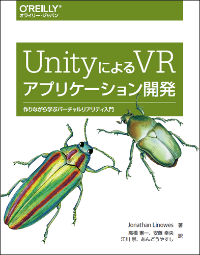

# UnityによるVRアプリケーション開発

---



---

本リポジトリはオライリー・ジャパン発行書籍『[UnityによるVRアプリケーション開発](http://www.oreilly.co.jp/books/9784873117577/)』（原書名『[Unity Virtual Reality Projects](https://www.packtpub.com/game-development/unity-virtual-reality-projects)』）のサポートサイトです。


## サンプルコード

サンプルコードの解説は本書籍をご覧ください。

### ダウンロード方法
Unity 5.4.x 系をお使いの場合は
<https://github.com/oreilly-japan/unity-virtual-reality-projects-ja/archive/master.zip>
から、

Unity 5.3.x 系をお使いの場合は
<https://github.com/oreilly-japan/unity-virtual-reality-projects-ja/archive/unity53x.zip>
から、それぞれダウンロードしてください。

### 使用方法
code フォルダーの下に本書のUnityプロジェクトを章ごとに完成した状態で用意してあります。ただし、Unity標準アセットやGoogle VR SDK等は含まれていないので、プロジェクトをUnityで開いたら次の手順で必要なものをインポートしてください。
（本書の手順に従って新規にプロジェクトを作成したい方は、`resources`フォルダーの下に各章ごとに必要なリソースファイルを置いてありますので、必要に応じてお使いください。）

1. メインメニューの［Assets］を選択します。それから［Import Package］→［Characters］の順に操作します。
2. インポート可能なすべてのものをリスト表示したインポートダイアログがポップアップするので［Import］をクリックします。
3. 同様にして［Assets］→［Import Package］→［Effects］の順に操作し、ポップアップしたインポートダイアログで［Import］をクリックします。
4. 同様にして［Assets］→［Import Package］→［ParticleSystems］の順に操作し、ポップアップしたインポートダイアログで［Import］をクリックします。
5. ウェブブラウザで<https://developers.google.com/vr/unity/download>を開いて、Google VR SDK for Unityをダウンロードします。
6. Unityのメインメニューの［Assets］から［Import Package］→［Custom Package...］を選択します。
7. ダウンロードした`GoogleVRForUnity.unitypackage`というファイルを見つけて選択します。
8. すべてのアセットにチェックが付いていることを確認して、［Import］をクリックします。
9. Projectパネルの`Assets`を選択し、シーン（Unityのロゴがアイコンになっているもの）をダブルクリックして開くとSceneビューにオブジェクトが表示されます。

[付録 A の GearVR 用のビルド設定はこちら](code/appendix-A)

[付録 B の Daydream用アプリケーション開発環境の設定はこちら](code/appendix-B)

## 実行環境

日本語版で検証に使用した各ソフトウェアのバージョン、およびハードウェアは次のとおりです。

#### ソフトウェア

* Unity 5.4.0f3 <br> Unityについては前バージョンである5.3.6f1での動作も確認しています。
* Blender 2.77
* Android SDK API level 23
* Xcode 7.3.1
* Google VR SDK for Unity v0.9.1

#### ハードウェア（括弧内はOSのバージョン）

* Samsung Galaxy S6 edge（Android 6.0.1）
* Nexus 5X（Android N Developer Preview 4）
* iPhone 6 Plus（iOS 9.3.2）
* MacBook Pro Retina, 13-inch, Mid 2014（Mac OS X 10.11.5）
* Windows PC, GPU: NVIDIA GeForce GTX980Ti（Windows 8）

#### VRデバイス

* Oculus Rift製品版、およびDK2
* Google Cardboard
* Sumsung Gear VR

## 正誤表

下記の誤りがありました。お詫びして訂正いたします。

本ページに掲載されていない誤植・間違いを見つけた方は、japan＠oreilly.co.jpまでお知らせください。

### 第1刷をお持ちの方

#### 4章 P.65 20行目

_誤_

```
車アイコンを押して［Rest］を選択します。
```

_正_

```
車アイコンを押して［Reset］を選択します。
```

#### 5章 P.116 17行目

_誤_

```
DetectMoveDown()関数はUpdaet()が呼ばれるたびにカメラのX回転（角）を取得して
```

_正_

```
DetectMoveDown()関数はUpdate()が呼ばれるたびにカメラのX回転（角）を取得して
```
